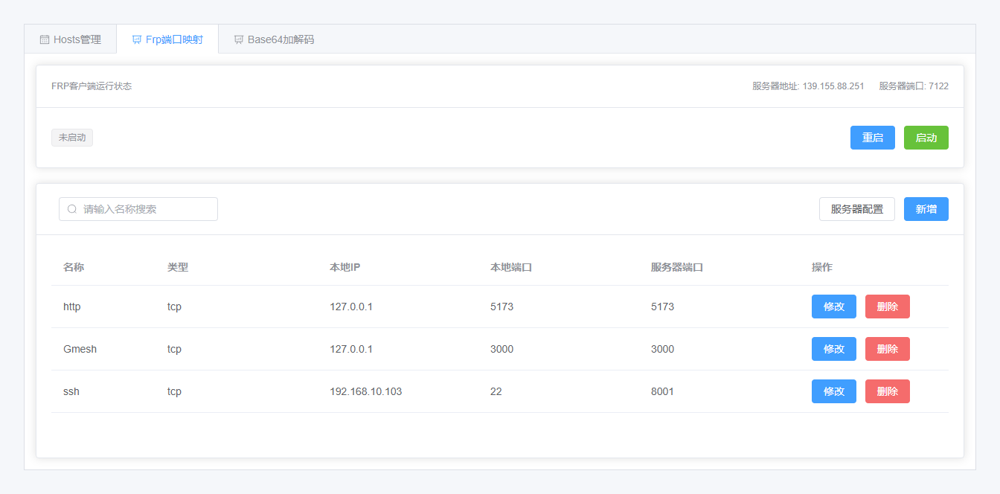

# Nic的私人工具

工作中经常遇到各种各样的小需求，整理了一下，开发一些小工具，目前只开发了`Hosts`和`FRP`端口映射管理工具

## 开发工具列表

### Hosts管理
管理本地的`hosts`首先是懒得记它的路径，其次是，有时候想同步`Github`的DNS解析方案来解决`Git` 访问非常慢的问题
- [x] 先实现Hosts的基本管理
- [ ] 再实现Hosts的同步，可以通过`url` 从同步`hosts`到本地
- [ ] 目录功能

### FRP 端口映射管理
`FRP` 端口映射在我本地服务器没有公网IP的时候非常有用，目前想实现的功能基本都实现了。 后面考虑要不要做服务器端的管理功能，通过`RPC` 进行远程调用
- [x] 实现 `FRP` 的启动和关闭及状态监控
- [x] 实现配置的管理（多字段映射）

## 工具待办
- 实现自动部署功能
- 实现身份验证功能，目前基本是裸奔的，非常不安全
